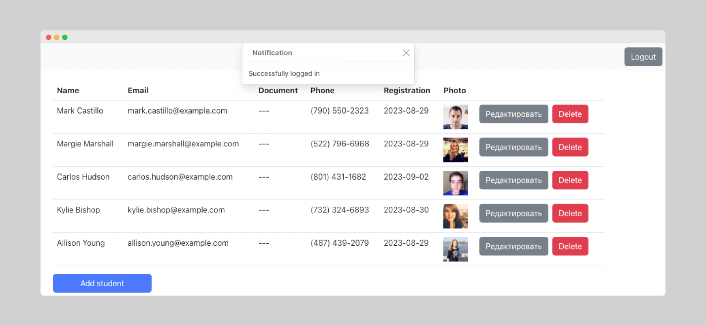
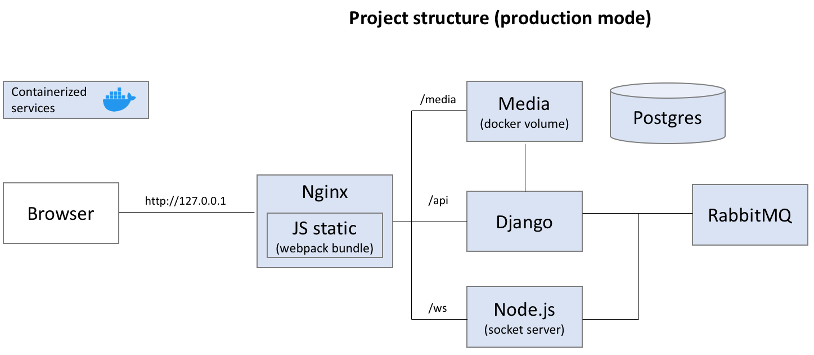
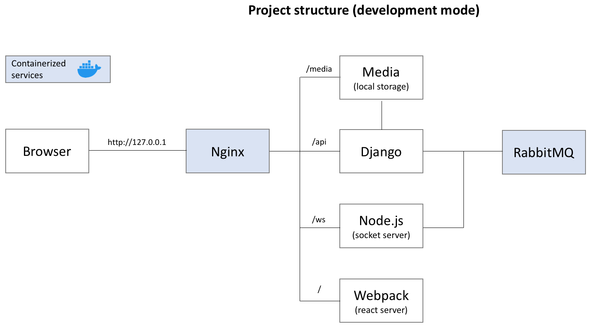

### Web demo

This is a web project based on Django, React, RabbitMQ and Websockets in Dockerized environment.

It demonstrates following capabilities:
- Student list management,
- Avatar upload,
- Real-time notifications.

#### Quick start

Install Docker, Docker-compose and run

```bash
docker-compose build
docker-compose up -d
```
Then check out http://127.0.0.1 in your browser:



#### Developer mode

Install NodeJS, Python, Django, then start developemnt environment via:

```bash
docker-compose -f dev.docker-compose.yml build
docker-compose -f dev.docker-compose.yml up -d
./start-dev.sh
```
Then check out http://127.0.0.1 in your browser.

All logs will be streamed to:
- log_server.log for Django,
- log_worker.log for Worker,
- log_react.log for React webpack,
- log_socket.log for Node.js.

To stop development environment run:
```bash
./stop-dev.sh
```





You are free to use it for your own projects, contributions are welcome!
