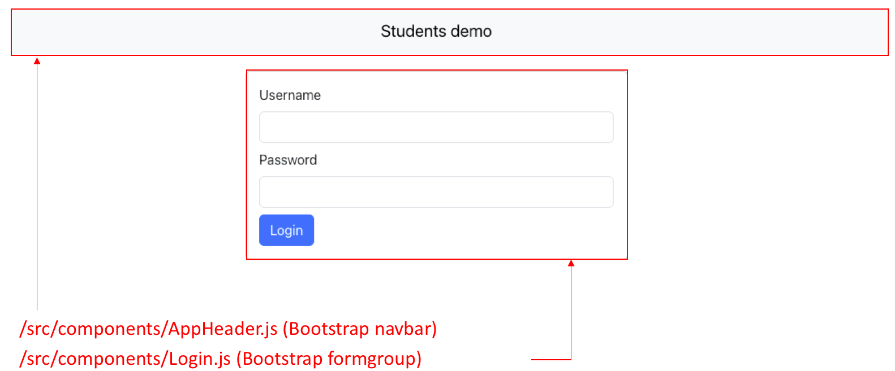
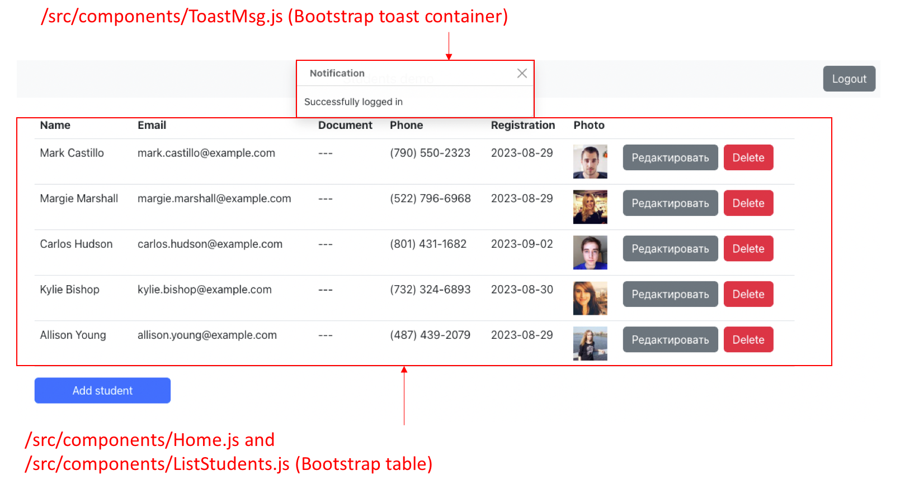
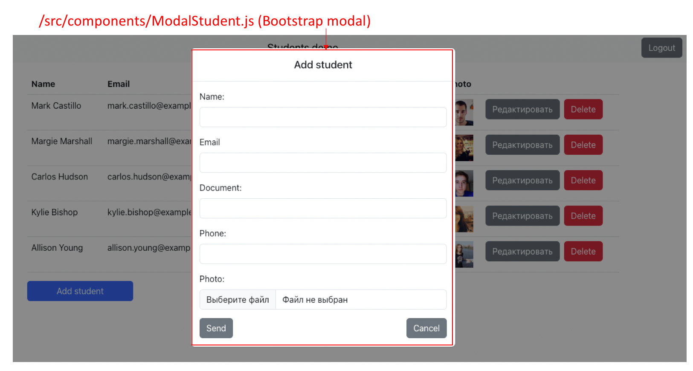

### Web demo (React app)

This is the front-end based on React, Bootstrap and Websockets.
It also includes Node.js socket server in socket.js

#### Quick start

For best experience refer to main [README](../README.md)

Otherwise, to run in webpack-only mode (without Django backend) install node.js and use following commands
```bash
npm install
npm run start
```

To run Node.js socket server
```bash
node socket.js
```

#### Key componens




